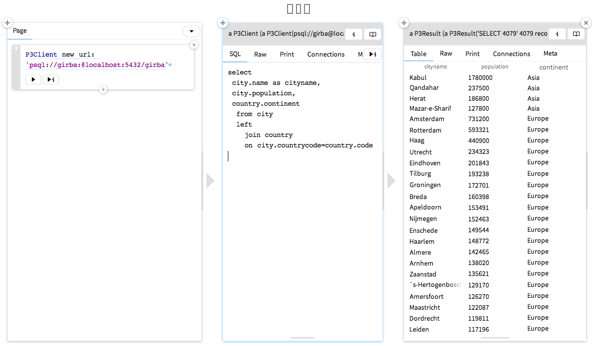

# GToolkit for P3

[Glamorous Toolkit](https://github.com/feenkcom/gtoolkit) for the [P3](https://github.com/svenvc/p3) Pharo client for Postgres.



## How to load the code

Execute the following code in a [Glamorous Toolkit image](https://gtoolkit.com):

```
Metacello new
   baseline: 'GToolkit4P3';
   repository: 'github://feenkcom/gt4p3';
   load.
```
